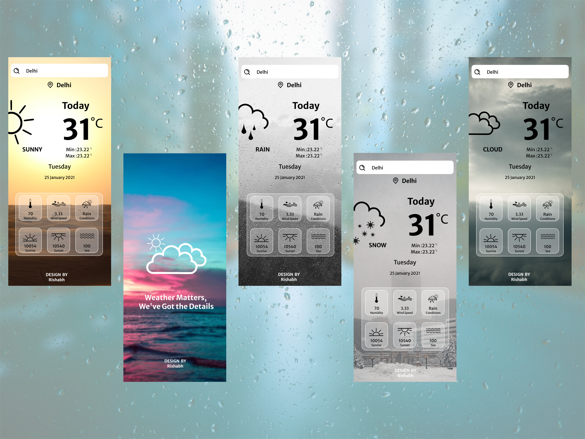

# WeatherWise

## Overview

WeatherWise is a weather application built with Kotlin and XML, providing users with real-time weather details using the OpenWeather API. Stay informed about the current temperature, daily forecasts, humidity, sea level, wind speed, weather conditions, sunrise, sunset, and more. The app also enhances user experience by dynamically changing the background based on the current weather conditions.

## Features

- **Real-time Weather Data:** Utilizes the OpenWeather API to fetch accurate and up-to-date weather information.
- **Comprehensive Details:** Displays current temperature, minimum and maximum temperatures for the day, humidity, sea level, wind speed, weather conditions, sunrise, and sunset.
- **Dynamic Backgrounds:** Enhances user experience by changing the app's background to reflect the current weather conditions.

## Screenshots




## Technologies Used

- **Language:** Kotlin
- **Markup:** XML
- **API:** OpenWeather API

## Getting Started

1. **Clone the Repository:**
   ```bash
   git clone https://github.com/rishabh129/WeatherWise.git

2. Open in Android Studio:
Open the project in Android Studio by navigating to the cloned directory.

3. Install Dependencies:
Android Studio will prompt you to install any missing dependencies. Follow the on-screen instructions to ensure all required dependencies are installed.

4. API Key:
Obtain an API key from OpenWeather. If you don't have an account, you'll need to sign up. Once you have the key, proceed to the next step.

5. Enter API Key:
In the code, locate the placeholder YOUR_API_KEY and replace it with the API key you obtained from OpenWeather. This key is necessary for fetching weather data.

   // Replace YOUR_API_KEY with your actual OpenWeather API key
   ```bash
   private const val API_KEY = "YOUR_API_KEY"

7. Run the App:
Build and run the app on an emulator or a physical device. Make sure your device is connected, and Android Studio is properly configured.

8. Explore Weather Details:
Once the app is running, explore the different weather details provided. Check the current temperature, minimum and maximum temperatures for the day, humidity, sea level, wind speed, weather conditions, sunrise, and sunset.

9. Dynamic Backgrounds:
Observe how the app's background dynamically changes based on the current weather conditions. This feature enhances the user experience and provides a quick visual representation of the weather.

10. Customize Backgrounds (Optional):
If you wish to customize or add background images, navigate to the res/drawable directory. Modify existing images or add new ones to represent different weather conditions. The app will automatically use these images based on the current weather.

11. Feedback and Contribution:
If you encounter any issues or have suggestions for improvement, please open an issue on GitHub.
Contributions are welcome! If you'd like to contribute to the project, fork the repository, make your changes, and submit a pull request.

12. Roadmap:
Check out the project roadmap to see upcoming features and improvements planned for WeatherWise.

13. Acknowledgments:
Thanks to OpenWeather for providing the weather API.
